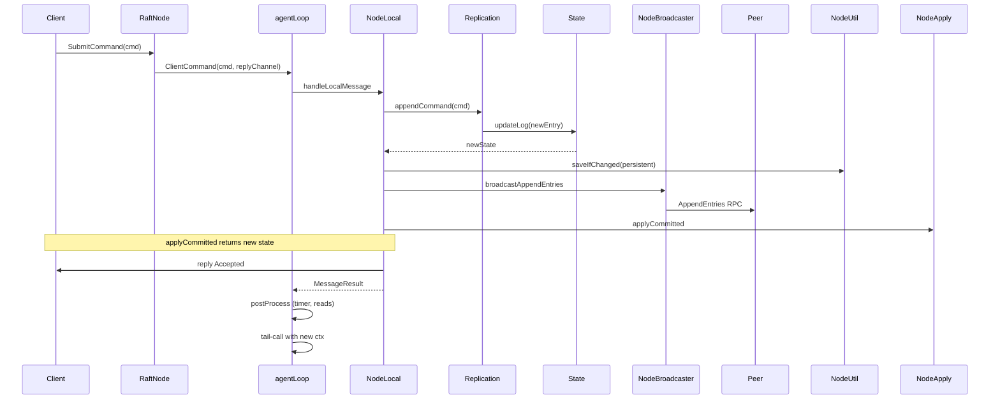
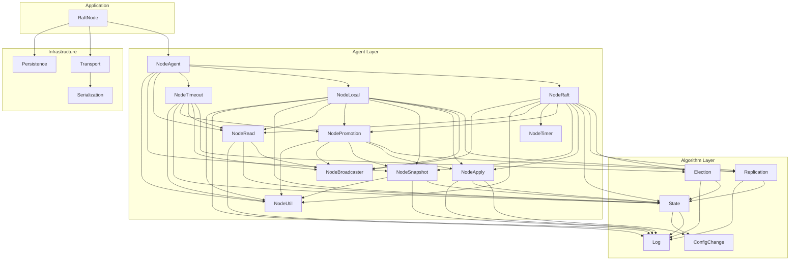

# Architecture

This document describes the high-level architecture of the Raft F# implementation. It assumes familiarity with the [Raft Consensus Algorithm](https://raft.github.io/).

See [docs/gotchas.md](gotchas.md) for common mistakes.
See [docs/trade-off.md](trade-off.md) for design trade-off analyses.

---

## Layer Overview

The system is organized into four layers:

```
┌──────────────────────────────────────────────────────────┐
│                    Application Layer                      │
│   RaftNode (Node.fs)         Raft.App / User callbacks    │
├──────────────────────────────────────────────────────────┤
│                   Agent / Actor Layer                     │
│   NodeAgent.fs   NodeRaft.fs   NodeLocal.fs               │
│   NodeTimeout.fs NodeRead.fs   NodeSnapshot.fs             │
│   NodeApply.fs   NodeBroadcaster.fs  NodePromotion.fs      │
│   NodeTimer.fs   NodeUtil.fs                              │
├──────────────────────────────────────────────────────────┤
│                  Pure Algorithm Layer                      │
│   Election.fs   Replication.fs   State.fs                 │
│   Log.fs        ConfigChange.fs                           │
├──────────────────────────────────────────────────────────┤
│                   I/O / Infrastructure                    │
│   Transport.fs   Persistence.fs   Serialization.fs        │
└──────────────────────────────────────────────────────────┘
```

### 1. Pure Algorithm Layer

The bottom layer consists of **pure functions with no side effects**. Given the same inputs, they always return the same outputs. They compute state transitions but do not perform I/O, start timers, or send messages.

| Module | Responsibility |
|---|---|
| `Election.fs` | `startElection`, `handleRequestVote`, `handleVoteResponse` — leader election logic |
| `Replication.fs` | `handleAppendEntries`, `handleAppendEntriesResponse`, `handleInstallSnapshot`, `advanceCommitIndex`, `appendCommand` — log replication and commit advancement |
| `State.fs` | `RaftState` constructors and transition helpers (`init`, `initLeaderState`, `updateTerm`, `takeSnapshot`, `hasQuorum`, joint consensus quorum) |
| `Log.fs` | Log data structure operations (`append`, `mergeEntries`, `truncateAndAppend`, `entriesFrom`, `trim`) |
| `ConfigChange.fs` | Serialization/parsing of joint consensus configuration commands |

These modules are directly testable without mocks or setup — they are the core of `IntegrationTests.fs`.

### 2. Agent / Actor Layer

The middle layer is built on F#'s `MailboxProcessor` (actor model). Each module in this layer:

- Receives a `NodeContext` (which carries the actor's inbox, current state, timers, and injected dependencies)
- Calls pure functions from the Algorithm Layer
- Produces a `MessageResult` specifying the new state and timer actions
- Relies on `NodeAgent.postProcess` to apply timer mutations, Config updates, and PendingRead updates to the context

| Module | Responsibility |
|---|---|
| `NodeAgent.fs` | The tail-recursive `agentLoop` — the central dispatcher. `Shutdown` is handled directly in `agentLoop` (disposes timers, cancels CTS, replies). All other messages route through `handleMessage`, which dispatches to handler modules (returning `MessageResult`) or handles `GetState`, `LinearizableRead`, and `TakeSnapshot` directly. Results flow through `postProcess` which applies timer actions, Config updates, and PendingRead updates before tail-calling. |
| `NodeRaft.fs` | `handleRaftRPC` — routes incoming `RaftMessage` cases to pure functions (`Election.*`, `Replication.*`), calls `saveIfChanged`, then applies committed entries, auto-snapshot, config finalization, timer actions, and pending read updates. |
| `NodeLocal.fs` | `handleLocalMessage` — dispatches `ClientCommand`, `AddPeer`, `RemovePeer` via `dispatchLocalMessage`. Each branch replies directly to the caller via the function-type callback embedded in the message. On leader: appends entries, broadcasts, applies committed, auto-snapshots, and finalizes configuration. On non-leader: returns `Redirect` with leader info. Also processes pending reads and returns `MessageResult` with timer actions. |
| `NodeTimeout.fs` | `handleElectionTimeout` — starts election (or promotes single-node cluster to leader). `handleHeartbeatTimeout` — sends heartbeats/append-entries and promotes non-voting peers. |
| `NodeRead.fs` | `canServePendingRead`, `classifyPendingReads`, `processPendingReads`, `handleLinearizableRead` — linearizable read protocol. Broadcasts heartbeat, classifies pending reads as `ReadReady` or `ReadRedirect`, replies to resolved reads. |
| `NodeSnapshot.fs` | `handleTakeSnapshot` (manual), `autoSnapshotIfNeeded` (threshold-based auto-compaction). |
| `NodeApply.fs` | `applyCommitted` — tail-recursively applies committed log entries to the state machine via `loopApplyCommitted`. Handles config change entries (joint/final/legacy), skips `NoOpCommand` sentinel entries, applies session deduplication. |
| `NodeBroadcaster.fs` | `broadcastRequestVote`, `broadcastHeartbeat`, `broadcastAppendEntries` (sends to both voting peers and `NonVotingPeers`), `sendAppendEntriesOrSnapshot` (falls back to `InstallSnapshot` when log is too far behind). |
| `NodePromotion.fs` | `tryPromoteNonVotingPeers` — promotes non-voting peers whose `MatchIndex` catches up. `tryFinalizeConfiguration` — appends final configuration entry when in `JointPhase`. |
| `NodeTimer.fs` | Centralized timer management — `getRandomElectionTimeout`, `createTimer`, `disposeTimer`, `applyElectionAction`, `applyHeartbeatAction`. `getTimerActionsOnRoleChange` returns `(TimerAction * TimerAction)` tuple based on old/new role transitions and whether a reply was sent. Handlers never touch `System.Threading.Timer` directly. |
| `NodeUtil.fs` | `saveIfChanged` (idempotent persistence flush), `sendAsync` (fire-and-forget transport send with error logging), `log` (printfn wrapper). |

### 3. I/O / Infrastructure Layer

| Module | Responsibility |
|---|---|
| `Transport.fs` | TCP listener and sender. Length-prefixed (4-byte big-endian) JSON framing over `TcpClient`/`TcpListener`. `TcpTransport` implements `ITransport`. `sendMessage` uses a 3-second `CancellationTokenSource` timeout per send. `readAsync` is tail-recursive for exact-length reads. |
| `Persistence.fs` | Atomic file persistence via `FileStream` + `Flush(true)` (fsync) + temp-file swap (`File.Move(..., overwrite=true)`). `FilePersistence` implements `IPersistence`, writing `state_{nodeId}.json` to the current working directory. Orphaned `.tmp` files from crashes are cleaned up on load. |
| `Serialization.fs` | `OptionConverterFactory` (generic `'T option` converter) and `RaftMessageConverter` (uses `FSharpType.GetUnionCases` map + `FSharpValue.GetUnionFields` reflection to serialize/deserialize the `RaftMessage` tagged union). |

### 4. Application Layer

| File | Responsibility |
|---|---|
| `Node.fs` | `RaftNode` class — public API. Constructs the `MailboxProcessor`, starts the transport listener and the agent loop. Exposes `SubmitCommand`, `SubmitCommandWithSession`, `LinearizableRead`, `PostLinearizableRead`, `SubmitTakeSnapshot`, `AddPeer`, `RemovePeer`, `GetState`, `TriggerElectionTimeout`, `TriggerHeartbeatTimeout`. Constructor catches `SocketException`/`IOException` from `StartListener`, cleans up, and re-raises. Implements `IDisposable`. |
| `Raft.App/Program.fs` | 3-node Key-Value Store demo with REPL. Commands: `put <key> <value>`, `get <key>` (via `LinearizableRead`), `state`, `quit`/`q`. |

---

## Message Flow Lifecycle

The diagram below traces a client command through the system:



A timeout flow follows a similar pattern — `ElectionTimeout` → `NodeTimeout.handleElectionTimeout` → `Election.startElection` → `NodeBroadcaster.broadcastRequestVote`.

---

## State Architecture

### State Hierarchy

```
NodeContext (tail-call argument in agentLoop — logically immutable, replaced each iteration)
├── Config (NodeConfig) — synced from State.Config by postProcess when config changes occur
├── Transport, Persistence — injected dependencies (immutable)
├── OnApply, OnInstallSnapshot, OnGetSnapshotData — callbacks (immutable)
├── Inbox (MailboxProcessor) — immutable
├── ElectionTimer, HeartbeatTimer (Timer option) — replaced by postProcess via NodeTimer
├── CancellationTokenSource — immutable
├── PendingReads (PendingRead list) — replaced by postProcess from MessageResult
└── State (RaftState) ← immutable value, replaced each iteration
    ├── Role (Follower | Candidate | Leader)
    ├── CurrentLeader (NodeId option)
    ├── Config (NodeConfig) ← updated when config change entries are applied
    ├── ConfigPhase (SinglePhase | JointPhase)
    ├── NonVotingPeers (PeerInfo list)
    ├── VotesReceived (Set<NodeId>)
    ├── LeaderState (LeaderState option)
    │   ├── NextIndex (Map<NodeId, LogIndex>)
    │   └── MatchIndex (Map<NodeId, LogIndex>)
    ├── Volatile (VolatileState)
    │   ├── CommitIndex
    │   └── LastApplied
    └── Persistent (PersistentState) ← flushed to disk via saveIfChanged
        ├── CurrentTerm
        ├── VotedFor (NodeId option)
        ├── Log (Map<LogIndex, LogEntry>)
        ├── Snapshot (Snapshot option)
        ├── SessionTable (Map<string, int64>)
        └── LastConfigIndex
```

### Persistence Boundary

`PersistentState` is the **only** structure written to disk. Every handler that mutates persistent fields must call `NodeUtil.saveIfChanged` before replying. The `saveIfChanged` helper is idempotent — it compares the old and new `Persistent` fields structurally and skips the write if unchanged.

The write is atomic: data is written to a `.tmp` file, flushed, then `File.Move(..., overwrite=true)` renames it over the target. On startup, orphaned `.tmp` files from a crash during a previous write are cleaned up.

### Immutable State Transitions

All state transitions follow this pattern:

```
ctx.State  ──►  handler  ──►  newState (RaftState)
                               │
                    ┌──────────┴──────────┐
                    ▼                     ▼
              saveIfChanged          MessageResult
              (if Persistent          { State = newState
               changed)                 ElectionAction
                                        HeartbeatAction
                                        PendingReads }
                                            │
                                            ▼
                                      postProcess
                                      (apply timers,
                                       update ctx)
                                            │
                                            ▼
                                      agentLoop (tail-call)
```

---

## Agent Loop Dispatch

The `agentLoop` in `NodeAgent.fs` dispatches messages as follows:

```fsharp
match msg with
| Shutdown reply    → handleShutdown ctx reply
| _                 → handleMessage ctx msg |> postProcess ctx |> agentLoop
```

`handleMessage` dispatches:
- `ElectionTimeout` / `HeartbeatTimeout` → `NodeTimeout.handleElectionTimeout` / `handleHeartbeatTimeout`
- `RaftRPC rpcMsg` → `NodeRaft.handleRaftRPC`
- `GetState` → inline reply + `MessageResult`
- `LinearizableRead` → inline: Leader creates `PendingRead` and calls `NodeRead.handleLinearizableRead`; non-Leader replies `ReadRedirect`
- `TakeSnapshot` → `NodeSnapshot.handleTakeSnapshot`, replies, returns `MessageResult`
- `ClientCommand` / `AddPeer` / `RemovePeer` → `NodeLocal.handleLocalMessage`

`postProcess` applies timer actions (`TimerAction → Timer.Change/createTimer`), updates `Config` from `result.State.Config` (if changed), and updates `PendingReads`.

Only `Shutdown` is handled entirely outside `handleMessage` and `postProcess` — it disposes timers, cancels the `CancellationTokenSource`, replies, and terminates the loop.

This makes adding a new message type straightforward:
1. Add the case to `NodeMessage` DU
2. Create a handler module returning `MessageResult`
3. Add one `match` arm in `handleMessage`

---

## Two-Phase Timer Control

Timers are never manipulated directly by handlers. Instead:

1. Handler returns `TimerAction` (`Keep | Reset | Stop`) in `MessageResult.ElectionAction` / `MessageResult.HeartbeatAction`
2. `postProcess` calls `NodeTimer.applyElectionAction` / `applyHeartbeatAction`
3. Those functions translate the action into actual `Timer.Change()` or `createTimer` calls

`NodeTimer.getTimerActionsOnRoleChange` computes the correct `(electionAction, heartbeatAction)` pair based on role transitions:

| Transition | Election Timer | Heartbeat Timer |
|---|---|---|
| → Leader | Stop | Reset |
| Leader → Follower/Candidate | Reset | Stop |
| Reply sent (no role change) | Reset | Keep |
| No reply, no role change | Keep | Keep |

On promotion to Leader, `getTimerActionsOnRoleChange` also calls `NodeBroadcaster.broadcastHeartbeat` to immediately announce leadership.

---

## Transport Wire Format

Messages are serialized as JSON using custom `System.Text.Json` converters (`RaftMessageConverter` in `Serialization.fs`). The union case name is the discriminator (`"Case"` property) with the payload in a `"Fields"` array. Messages are framed with a **4-byte big-endian length prefix** followed by the UTF-8 JSON payload, so there is no hard size limit.

TCP connection timeout for outbound messages is **3 000 ms** (hardcoded in `Transport.sendMessage`).

`NodeMessage` cases that carry reply callbacks (`ClientCommand`, `LinearizableRead`, `GetState`, `TakeSnapshot`, `AddPeer`, `RemovePeer`, `Shutdown`) are never sent over the wire — they are only posted locally to the inbox.

---

## Module Dependency Graph



---

## Key Architectural Properties

### Safety via Serialization

All state mutations are serialized through the `MailboxProcessor` inbox. Since the actor processes one message at a time, there are no concurrent state accesses. This eliminates the need for locks, mutexes, or `Monitor.Enter` while guaranteeing Raft's safety properties.

### Testability via Pure Functions

The Algorithm Layer (`Election`, `Replication`, `State`, `Log`) contains zero I/O. Tests create `RaftState` values, call functions, and assert on the returned state — no mocks, no timers, no network setup. The `IntegrationTests.fs` suite exercises full Raft scenarios (election, replication, split-brain, stale leader rejection) entirely through these pure functions.

### Crash Recovery

On restart, `RaftNode` calls `persistence.Load()` to load `PersistentState`. The `State.init` function calls `recoverConfigPhase`, which uses `LastConfigIndex` to determine the configuration phase without scanning the entire log. The node then starts as `Follower`, arms its election timer, and rejoins the cluster through normal RPC flow.

### Extensibility

The injected dependencies (`ITransport`, `IPersistence`, `onApply`, `onInstallSnapshot`, `onGetSnapshotData`) make the node adaptable: swap `TcpTransport` for an in-memory transport for testing, or replace `FilePersistence` with cloud storage.
